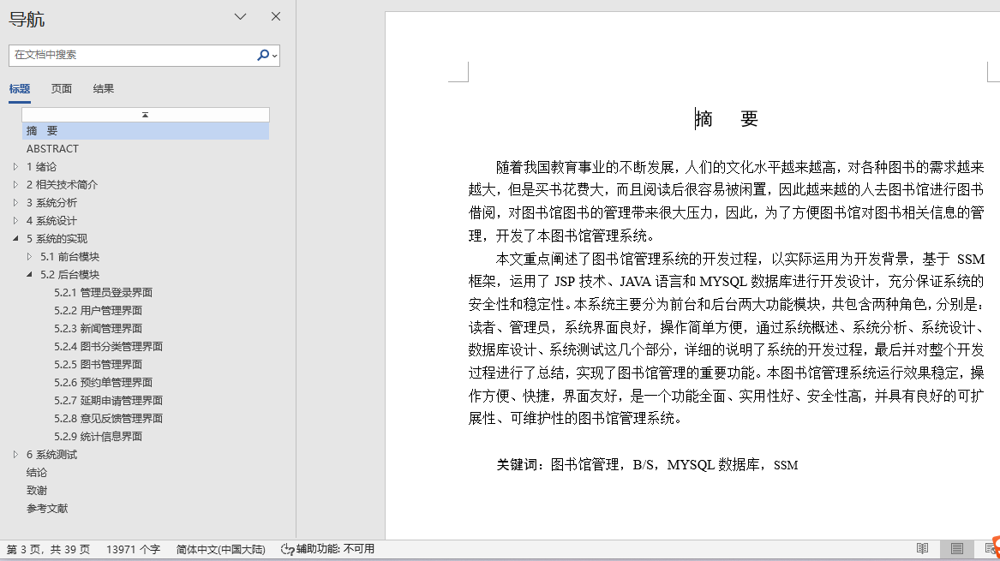
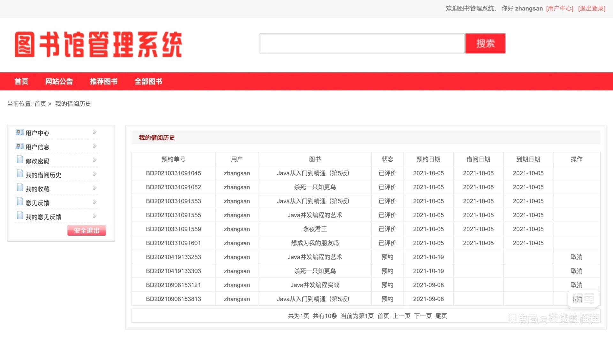
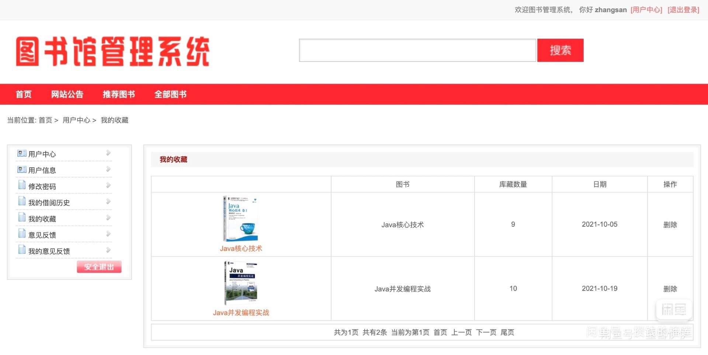
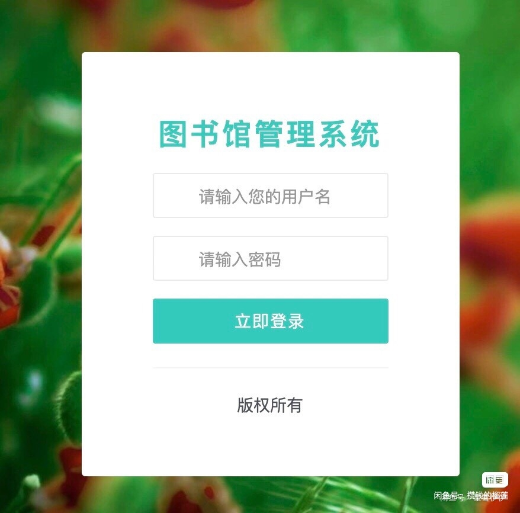
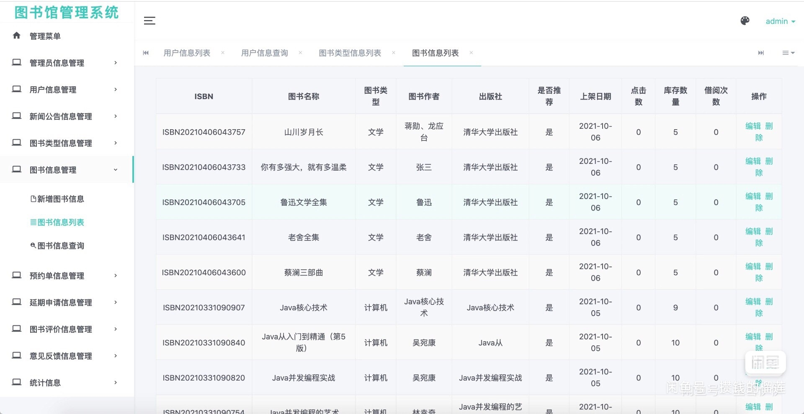
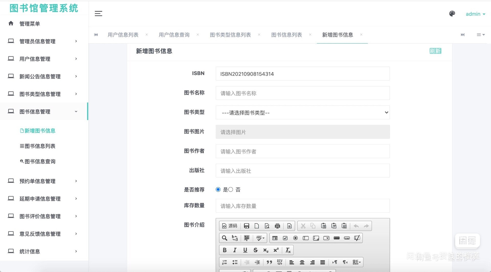
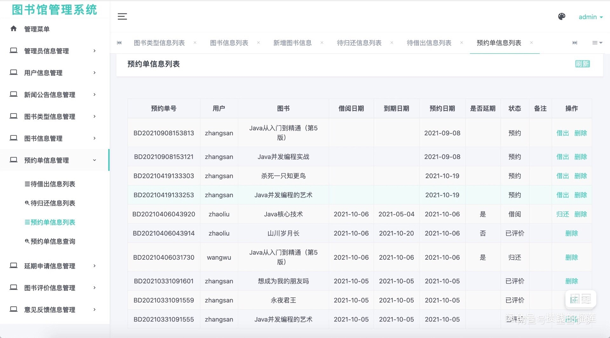
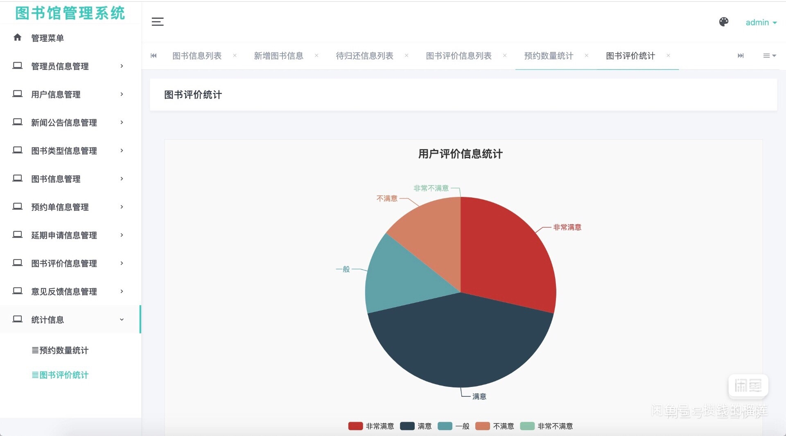
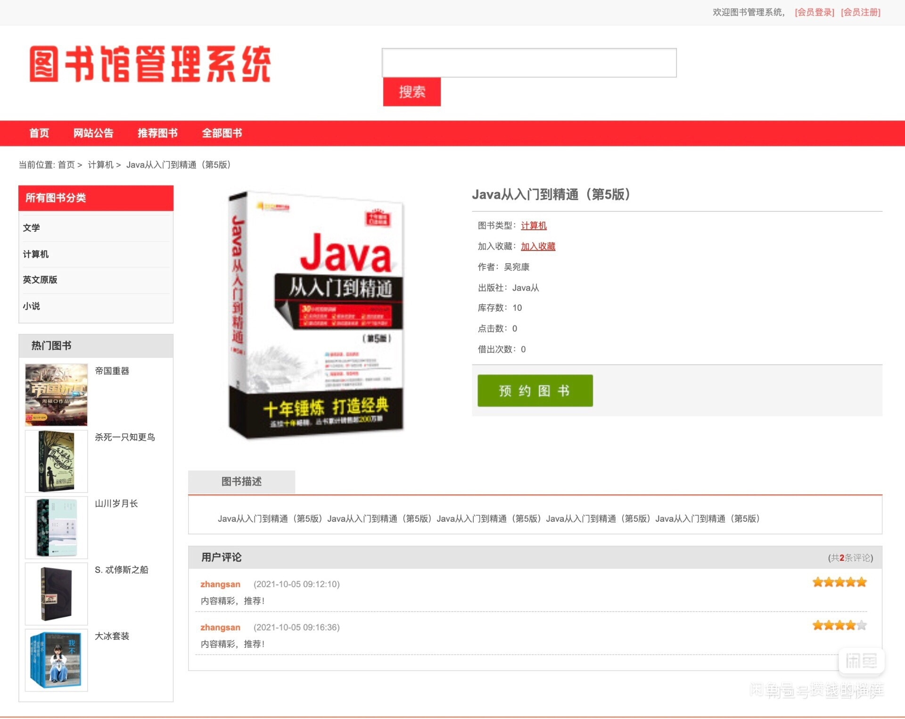

## 基于SSM框架实现的图书馆管理系统(程序+报告)

###  获取sql数据库文件: 从戎源码网 (https://armycodes.com/) QQ: 386869957 QQ群: 377586148
###  所有系统地址: (https://github.com/YuLin-Coder/AllProjectCatalog) 
###  所有项目以及源代码本人均调试运行无问题 可支持远程安装部署调试、定制修改、代码讲解

## 项目介绍
基于SSM框架实现的图书馆管理系统，包含两种角色：管理员、用户,系统分为前台和后台两大模块，主要功能如下。

【用户】：
1. 注册登录：用户可以通过注册账号并登录系统。
2. 浏览新闻公告：用户可以查看图书馆发布的最新新闻和公告。
3. 搜索图书：用户可以根据关键字搜索图书，并查看图书的详细信息。
4. 借阅图书：用户可以借阅图书，并记录借阅的时间和归还的时间。
5. 修改个人信息：用户可以查看和修改个人信息，包括姓名、联系方式等。
6. 修改密码：用户可以修改登录密码。
7. 我的借阅历史：用户可以查看自己的借阅历史记录。
8. 我的收藏：用户可以收藏感兴趣的图书，并查看已收藏的图书。
9. 我的意见反馈：用户可以给图书馆提供意见和反馈。

【管理员】：
1. 登录：管理员可以使用自己的账号进行系统登录。
2. 个人信息：管理员可以查看和修改个人信息。
3. 参数管理：管理员可以管理系统的参数设置，如借阅期限、罚款标准等。
4. 新闻公告管理：管理员可以发布、编辑和删除新闻公告。
5. 关于我们管理：管理员可以管理关于图书馆的介绍和信息。
6. 用户管理：管理员可以管理系统中的用户，包括添加、编辑和删除用户信息。
7. 图书管理：管理员可以管理图书的信息，包括添加、编辑和删除图书。
8. 借阅管理：管理员可以管理用户的借阅记录，包括借阅、归还和续借等操作。
9. 留言管理：管理员可以管理用户的留言和意见反馈。

## 项目技术
- 编程语言：Java
- 数据库：MySQL
- 前端技术：JSP、HTML、Jquery、Bootstrap、Layui、ECharts
- 后端技术：Spring、SpringMVC、MyBatis

## 运行环境
- JDK版本：JDK1.8及以上
- 开发工具：IDEA、Ecplise、Myecplise都可以
- 数据库: MySQL5.7及以上

## 运行截图

